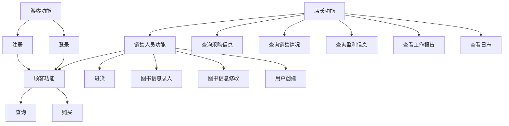
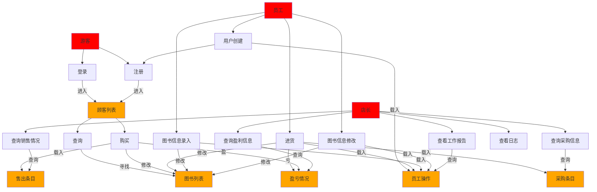

# 需求分析文档
## 顾元熙
### 业务流图

### 数据流图

### 数据词典
- Customer_list: 存储所有的顾客信息，每次游客注册后，都会被存储进入
- Book_list: 存储所有的图书信息，包括 ISBN 号、书名、作者、关键字、库存量、单价
- Sell_list: 存储每一条出售记录
- Stock_list: 存储每一条进货记录
- Staff_operation: 存储员工的每一条操作
- Profit: 一个`double`类型变量存储盈亏情况
### 功能说明&用户交互设计
- `visitor.register [string]` : 在 `Customer_list` 中加入这个用户
- `visitor.log_in [string]`: 在 `Customer_list` 中找到并以此用户进行操作，返回 `true/false`
- `costumer.inquire [string]`: 在 `Book_list` 中找到这本书，如果没有则返回某特征值, 如果有则返回这个图书的全部信息
- `costumer.buy [string][int]`: 在 `Book_list` 中找到这本书，并在  `Book_list` 中修改库存，如果找不到书或者库存不足则返回某特征值, 在 `Sell_list` 中存储这一条消费记录，并修改 `Profit`
- `seller.stock [string][int][double]`: 在 `Book_list` 中找到这本书，并在  `Book_list` 中修改库存， 在 `Stock_list` 中存储这一条消费记录，并修改 `Profit`
- `seller.input_information [string][string][string][string][int][double]`: 录入`Book_list`
- `seller.change [string]`: 修改 `Book_list`，如果没有则返回 `false`, 否则返回`true`
- `manager.inquire [string]`: 查询 `Stock_list` or `Sell_list` or `Staff_operation` or `Profit`, 返回相应的内容